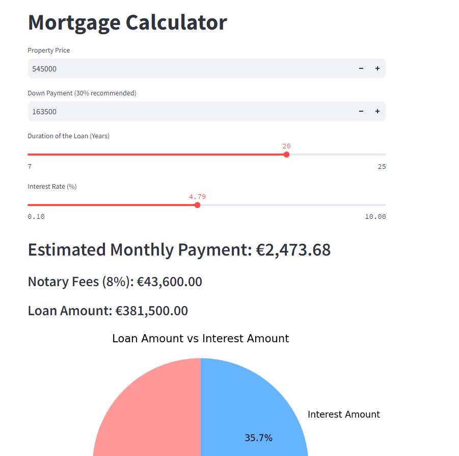

# [Mortgage Calculator](https://blog.stackademic.com/from-zero-to-hero-master-streamlit-launch-your-web-app-today-f91e08f7cbc7)


### Create `.env` from `env.sample`


<br />

## Manual Build

> Download the code 

```bash
$ git clone https://github.com/RolandBouwer/streamlit_mortgage_calculator.git
```

<br />

### 👉 Set Up for `Unix`, `MacOS` 

> Install modules via `VENV`  

```bash
$ virtualenv env
$ source env/bin/activate
$ pip install -r requirements.txt
```

> Start the app

```bash
$ flask run
// OR
$ streamlit run mortgage_calculator.py
```

At this point, the app runs at `http://localhost:8501`. 

<br />

### 👉 Set Up for `Windows` 

> Install modules via `VENV` (windows) 

```
$ virtualenv env
$ .\env\Scripts\activate
$ pip install -r requirements.txt

<br />


```

<br />